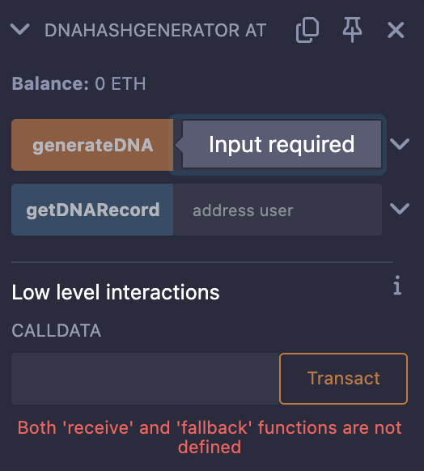
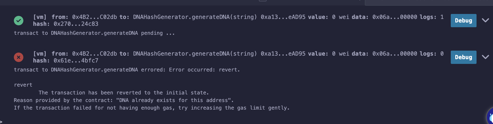
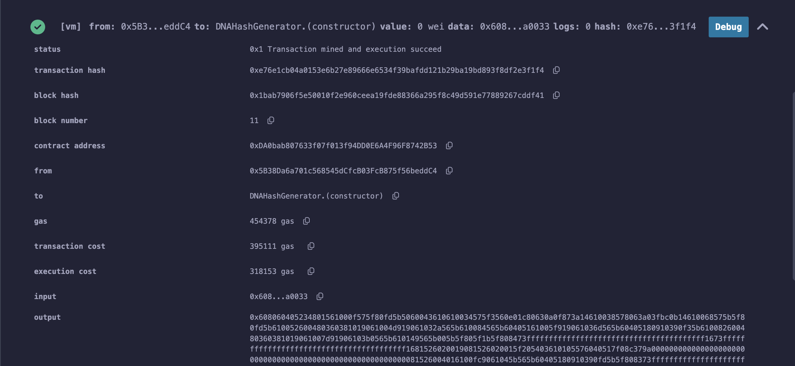

# 🧬reDNAHashGenerator Smart Contract

## Description
The **DNAHashGenerator** is a Solidity smart contract that allows users to generate a unique Keccak-256 hash based on an input string and associate it with their address.

## ✨ Features
- Generates a unique hash based on user input.
- Stores the hash linked to the sender’s address.
- Uses **keccak256** for secure hashing.
- Prevents duplicate DNA generation for the same address.
- Includes input validation to avoid empty submissions.
- **Allows the contract owner to delete DNA records.**
- **Provides a function to retrieve one's own stored DNA hash.**

## 🫠 How It Works
1. **Deploy the contract** using Remix or Hardhat.
2. **Call `generateDNA(string)`** with an input string (only the contract owner can register DNA records).
3. **Retrieve the stored hash** for an address using `getDNARecord(address)`.
4. **Users can retrieve their own stored DNA using `getMyDNARecord()`**.
5. **The contract owner can delete DNA records using `deleteDNARecord(address)`**.

## 🔒 Security Enhancements
- **Validation to prevent empty input submissions.**
- **Prevention of duplicate DNA generation** for the same address.
- **Only the contract owner can generate and delete DNA records.**

## 🔍 DNA Retrieval Screenshot
Here is a screenshot showing the retrieval of the hash:

## 🔒 Input Validation
When trying to submit an empty input, the button is disabled:

## ⛔️ Duplicate DNA Rejection
Attempting to generate DNA twice for the same address results in an error:

## 📂 Contract Code
The contract is available in the `contracts/` directory.

## 🚀 Gas Optimizations
- **Replaced `string memory` with `string calldata`** in `generateDNA()` to reduce memory usage and lower gas costs.
- **Ensured efficient use of storage** by reading before writing where applicable.

## 🚀 Deployment
The smart contract was successfully deployed in the Remix environment. Below is a screenshot of the deployment:

## 🚀 Next Steps
- Deploy on a testnet.

## 📣 About This Repository
This repository is part of my journey in **Building My Blockchain Stack** as I progress in blockchain development.
# 🧬 DNAHashGenerator Smart Contract

The **DNAHashGenerator** is a Solidity smart contract that allows users to generate a unique Keccak-256 hash based on an input string and associate it with their address.

## ✨ Features:
- Generates a unique hash based on user input.
- Stores the hash linked to the sender’s address.
- Uses `keccak256` for hashing.

## 🔧 How It Works:
1. Deploy the contract on Remix.
2. Call `generateDNA(string)` with an input string.
3. Retrieve the stored hash for an address using `dnaRecords(address)`.

## Security Enhancements:
- Added input validation to prevent empty submissions.
- Prevented duplicate DNA generation for the same address.

## Code Readability & Maintainability:
- Improved function structuring and comments for better clarity.

### 🔍 DNA Retrieval Screenshot
Here is a screenshot showing the retrieval of the hash:

### Input Validation

When trying to submit an empty input, the button is disabled:

### Duplicate DNA Rejection

Attempting to generate DNA twice for the same address results in an error:

## 📂 Contract Code:
The contract is available in the **contracts/** directory:

🚀 Gas Optimizations:
- Replaced `string memory` with `string calldata` in `generateDNA()` to reduce memory usage and lower gas costs.
- Ensured efficient use of storage by reading before writing where applicable.

## 🚀 Deployment

The smart contract was successfully deployed in the Remix environment. Below is a screenshot of the deployment:

## 🚀 Next Steps:
- Implement a verification system.
- Optimize gas usage.
- Deploy on a testnet.

## 📢 About This Repository:
This repository is part of my journey in **Building My Blockchain Stack** as I progress in blockchain development.

