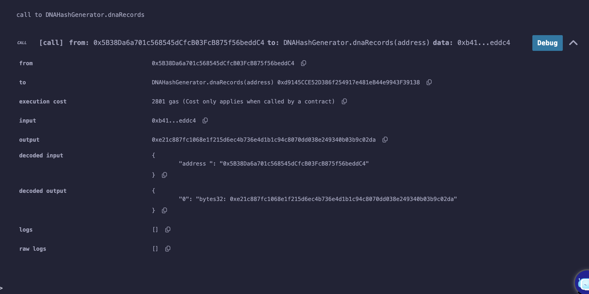

# 🧬 DNAHashGenerator Smart Contract

The **DNAHashGenerator** is a Solidity smart contract that allows users to generate a unique Keccak-256 hash based on an input string and associate it with their address.

## ✨ Features:
- Generates a unique hash based on user input.
- Stores the hash linked to the sender’s address.
- Uses `keccak256` for hashing.

## 🔧 How It Works:
1. Deploy the contract on Remix.
2. Call `generateDNA(string)` with an input string.
3. Retrieve the stored hash for an address using `dnaRecords(address)`.

### 🔍 DNA Retrieval Screenshot
Voici une capture d’écran montrant la récupération du hash:

## 📂 Contract Code:
The contract is available in the **contracts/** directory:

## 🚀 Next Steps:
- Implement a verification system.
- Optimize gas usage.
- Deploy on a testnet.

## 📢 About This Repository:
This repository is part of my journey in **Building My Blockchain Stack** as I progress in blockchain development.

